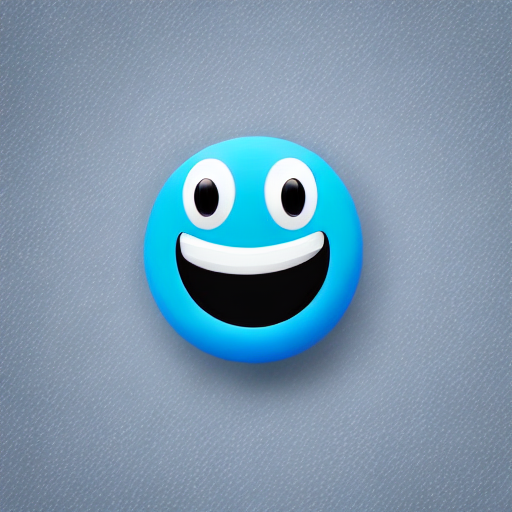
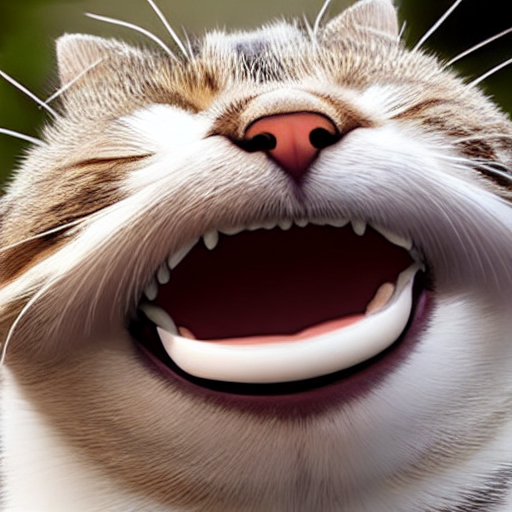
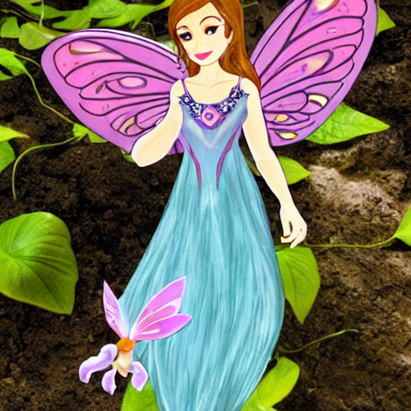
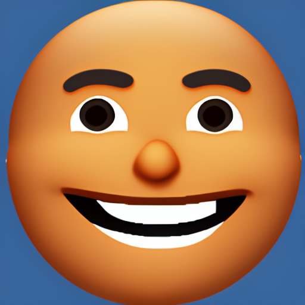
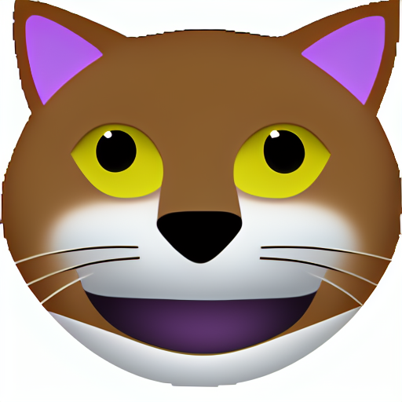
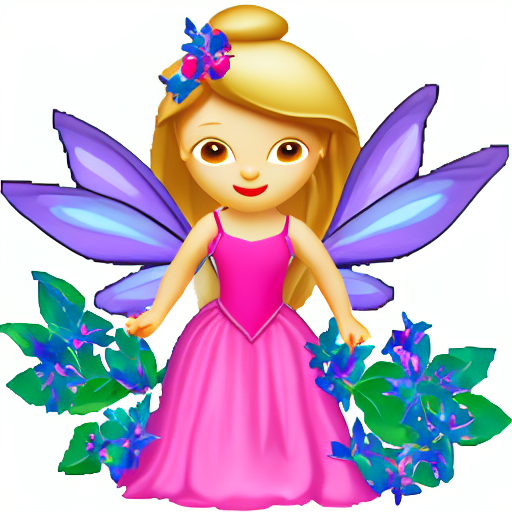
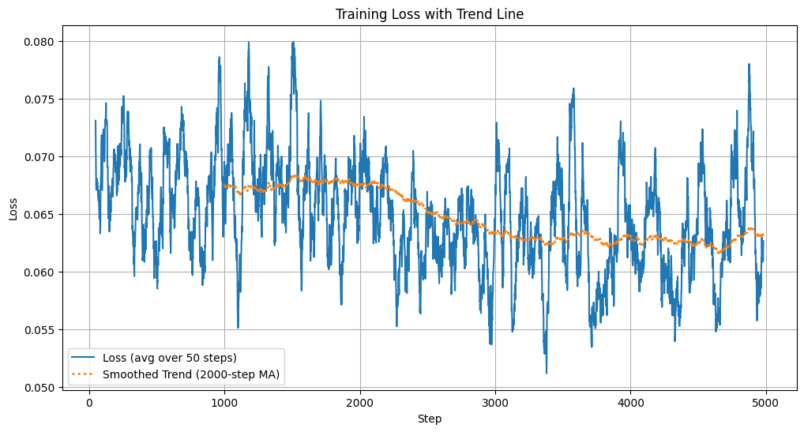

# 🧠 StableEmote  
**Finetuning Stable Diffusion 1.5 using LoRA for Custom Emoji Generation**

---

## 🧩 Overview

**StableEmote** is a mini educational project that explores the inner workings of **Stable Diffusion**, **LoRA fine-tuning**, **VAE**, and **CLIP**.  
The goal is to generate custom **emojis** by fine-tuning the **Stable Diffusion 1.5** model using the **LoRA (Low-Rank Adaptation)** technique.  

This project demonstrates a lightweight and efficient approach to personalization of generative models on limited hardware (Google Colab T4 GPU, 16 GB VRAM).

---

## 🚀 Key Features

- Fine-tuned **Stable Diffusion 1.5** using **LoRA**  
- Trained on **custom emoji dataset**
- **VAE** and **CLIP text encoder** frozen during training
- **UNet** fine-tuned for style and concept learning  
- Logged all metrics and generations via **Weights & Biases (W&B)**
- Model checkpoints uploaded to **Hugging Face Hub**
- Includes **pre-trained** and **fine-tuned** sample generations for comparison

---

## ⚙️ Architecture

## ⚙️ Training Details

| Parameter | Value |
|------------|--------|
| **Base Model** | Stable Diffusion 1.5 |
| **Training Steps** | 4500 |
| **Batch Size** | 8 |
| **Resolution** | 256 × 256 |
| **Precision** | bf16 (mixed precision) |
| **Learning Rate** | 1e-4 |
| **Hardware** | Google Colab T4 (16 GB VRAM) |
| **Training Time** | ~6–7 hours |
| **Logging** | Weights & Biases (wandb) |
| **LoRA Target** | UNet (VAE & CLIP frozen) |

---

## 📊 Training Workflow

1. **Dataset Preparation**  
   Curated and preprocessed a custom emoji dataset.  

2. **Base Model Setup**  
   Loaded the pre-trained **Stable Diffusion 1.5** weights via the `diffusers` library.

3. **LoRA Fine-Tuning**  
   Applied LoRA on the **UNet** layers while freezing the **VAE** and **CLIP text encoder** to optimize memory and training speed.

4. **Experiment Tracking**  
   All losses, samples, and metrics logged in **W&B** dashboard.

5. **Checkpoint Upload**  
   Final checkpoints uploaded to the **Hugging Face Hub** for public access.

---

## 🧠 Technical Insights

- **Why LoRA?**  
  LoRA allows efficient fine-tuning of large models by injecting low-rank trainable matrices, making it possible to train on GPUs with limited VRAM like the T4.

- **Why Stable Diffusion 1.5?**  
  SD 1.5 is an older model (not state-of-the-art compared to SDXL or Flux), but it is still ideal for lightweight experimentation and education.  
  Its smaller memory footprint makes it suitable for single-GPU setups like Google Colab.

---

## 🖼️ Sample Results

### 🎨 Pre-trained Model (Stable Diffusion 1.5)

| | |
|---|---|
|    **Smiling Face (Base)** |    **Smiling Cat (Base)** |
|    **Fairy (Base)** |    **Crying Face (Base)** |

### 🧑‍🎨 Fine-tuned Model (StableEmote)

| | |
|---|---|
|    **Smiling Face (Fine-tuned)** |    **Cat Face (Fine-tuned)** |
|    **Fairy (Fine-tuned)** |    **Supervillain (Fine-tuned)** |

> Note: Model got the rough understanding of what exactly an emoji like image means in 4.5 iterations. The image generation difference is evident of that.  
> Extended training (~10k steps) is expected to yield more consistent and expressive results — planned for future iterations.
> Check out the inference notebooks for detailed image generation results

---

## 🧠📊 Loss Plot

**Average Loss (first 500 steps):** 0.06776419130712748  
**Average Loss (last 500 steps):** 0.06440320606157184

---

## 🔗 Resources

- **Dataset:** [Emoji Dataset](https://huggingface.co/datasets/valhalla/emoji-dataset)
- **Base Model (SD 1.5):** [Hugging Face Link](https://huggingface.co/stable-diffusion-v1-5/stable-diffusion-v1-5)
- **Fine-tuned Model Checkpoints:** [LoRA weigths](https://huggingface.co/SurAyush/StableEmote_LoRA)

---

## 💡 Future Work

- Complete training for **10,000+ steps** to improve consistency  
- Experiment with **different emoji styles** and **LoRA ranks**
- Explore **SDXL LoRA fine-tuning** on higher-end GPUs
- Build a **Gradio demo** for interactive emoji generation

---

## 🤝 Contributions

Suggestions, corrections, and contributions are **warmly welcomed**!  
If you have ideas to improve emoji quality, dataset diversity, or LoRA configurations — feel free to open an issue or pull request.

---

## 🧾 License

This project is released for **educational and research purposes** only.  
Please refer to the individual model and dataset licenses for usage rights.

---

## 🧑‍💻 Author

**[Ayush]**  
Exploring multimodel AI, diffusion models, and creative ML tools.  
📫 Send me a message in {LinkedIn](https://www.linkedin.com/in/ayush-sur-6222b0291/)

---

